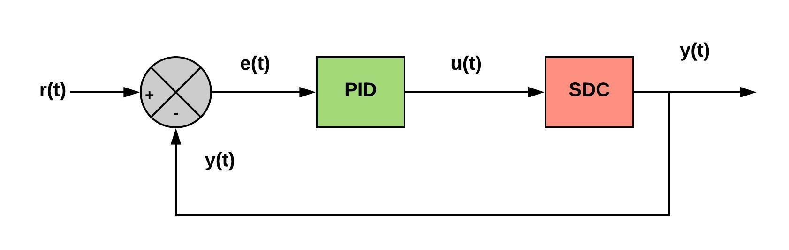

# PID Controller Design for Steering and Throttle Control of a Self Driving Car

---

## Dependencies
* cmake >= 3.5 (https://cmake.org/install/)
* make >= 4.1 
* gcc/g++ >= 5.4 
* uWebSockets (https://github.com/uNetworking/uWebSockets)
* Udacity Simulator (https://github.com/udacity/self-driving-car-sim/releases)

## Runing the PID control simulation
1. Open terminal
2. cd to the directory
3. bash clean.sh
4. bash build.sh
5. bash run.sh

## Implementation

This project develops a PID controller for Udacity's self-driving car simulator.  The project is implemented in C++ and communicates with the simulator using a local WebSocket. The simulator sends the cross track error, velocity and orientation information to the controller which sends back the steering and throttle values to control the simulated car along the reference trajectory.

## For more information and results
https://wp.me/p9KXJx-4a

## Contributers
Avinash Sharma: avinashmnit30@gmail.com

## License and Copyright
© Avinash Sharma

